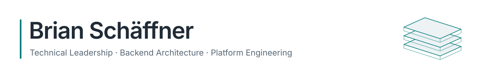
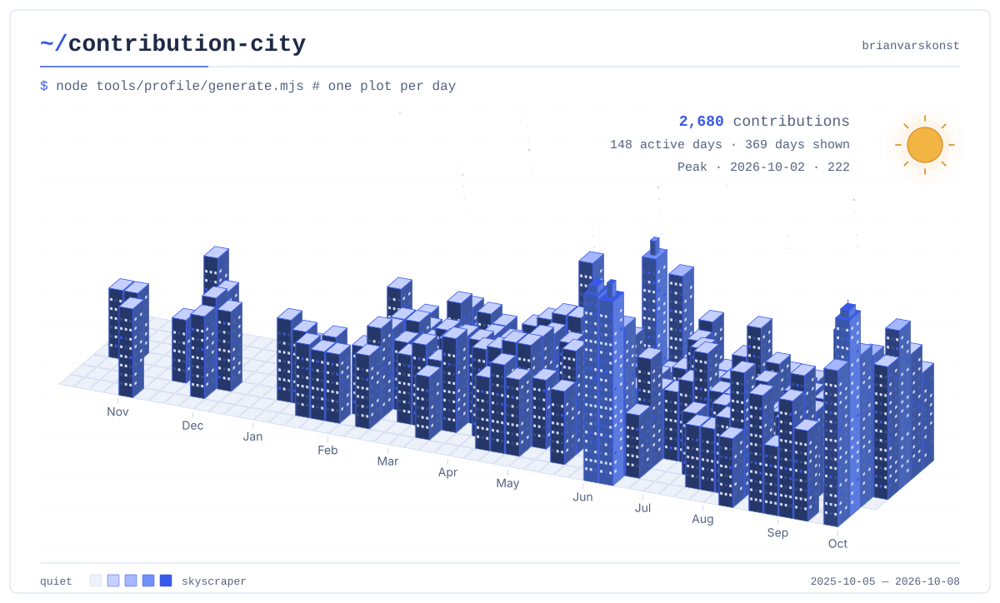

<!-- profile-header:start -->
<picture>
  <source media="(prefers-color-scheme: dark)" srcset="assets/header-dark.svg" />
  <source media="(prefers-color-scheme: light)" srcset="assets/header-light.svg" />
  
</picture>
<!-- profile-header:end -->

# Technical Leadership & Platform Engineering

Technical leadership, backend architecture and platform engineering for business-critical software systems.

I work at the intersection of architecture, delivery, DevOps and engineering leadership, with a strong focus on maintainable systems, clear technical direction and calm execution under pressure.

<!-- contribution-city:start -->
<picture>
  <source media="(prefers-color-scheme: dark)" srcset="assets/contribution-city-dark.svg" />
  <source media="(prefers-color-scheme: light)" srcset="assets/contribution-city-light.svg" />
  
</picture>

<!-- contribution-summary:start -->
**2,713 contributions** · **149 active days** 
Visible calendar: 2025-10-05 — 2026-10-09. 
Peak: 2026-10-02 · 222 contributions.
<!-- contribution-summary:end -->

A view of my [GitHub contribution activity](https://github.com/brianvarskonst?tab=overview). Each tile is one day; building height reflects activity.
<!-- contribution-city:end -->

---

## Focus

I care about building software systems that teams can understand, operate and improve over time.

My work usually centers around:

- backend architecture and modernization
- platform and developer experience
- CI/CD, automation and operational reliability
- pragmatic legacy system improvement
- technical decision-making and team alignment
- translating product and business goals into engineering execution

---

## Current Work

I am currently building and maintaining open source packages around structured WordPress development, Symfony-inspired architecture and reusable engineering workflows.

### SymPress

[SymPress](https://github.com/SymPress) brings Symfony components into WordPress without turning WordPress into something unrecognizable.

The goal is to keep WordPress flexible while adding structure where it pays off: dependency injection, events, configuration, contracts, testable packages and reusable workflows.

| Project | Focus |
|---|---|
| [sympress/workflows](https://github.com/SymPress/workflows) | Reusable GitHub Actions workflows for QA, releases, security checks and deployments |
| [sympress/kernel](https://github.com/SymPress/kernel) | WordPress application kernel and shared Symfony-powered service container |
| [sympress/coding-standards](https://github.com/SymPress/coding-standards) | PHP coding standards for scalable WordPress development |
| [sympress/wp-cli-console](https://github.com/SymPress/wp-cli-console) | Symfony Console wrappers for useful WP-CLI workflows |
| [sympress/assets](https://github.com/SymPress/assets) | Composer package for managing scripts and styles in WordPress projects |

---

## Selected Engineering Work

- Built reusable GitHub Actions workflows for QA, security checks, releases and deployment automation across SymPress packages.
- Designed a Symfony-inspired WordPress kernel with dependency injection, package discovery and testable service boundaries.
- Maintained coding standards and project conventions to keep PHP projects consistent, reviewable and easier to scale.
- Created reusable templates and boilerplates for Symfony, Shopware and PHP projects to reduce setup friction and improve delivery quality.

---

## Technical Background

<!-- technology-icons:start -->
<picture>
  <source media="(prefers-color-scheme: dark)" srcset="https://skillicons.dev/icons?i=php%2Csymfony%2Cwordpress%2Cts%2Cjs%2Cnodejs%2Cdocker%2Caws%2Cgithubactions%2Cgithub%2Cgitlab%2Cgit%2Clinux%2Cnginx%2Cmysql%2Cpostgres%2Credis%2Celasticsearch%2Crabbitmq%2Csentry%2Ccs%2Cswift%2Cpython%2Cgo%2Csass&amp;perline=13&amp;theme=dark" />
  <source media="(prefers-color-scheme: light)" srcset="https://skillicons.dev/icons?i=php%2Csymfony%2Cwordpress%2Cts%2Cjs%2Cnodejs%2Cdocker%2Caws%2Cgithubactions%2Cgithub%2Cgitlab%2Cgit%2Clinux%2Cnginx%2Cmysql%2Cpostgres%2Credis%2Celasticsearch%2Crabbitmq%2Csentry%2Ccs%2Cswift%2Cpython%2Cgo%2Csass&amp;perline=13&amp;theme=light" />
  
</picture>
<!-- technology-icons:end -->

**Backend & Platforms**  
PHP · Symfony · WordPress · WooCommerce · Shopware · Node.js · TypeScript

**DevOps & Infrastructure**  
Docker · DDEV · GitHub Actions · GitLab CI · Linux · Nginx · Traefik · AWS · Hetzner

**Data & Services**  
MySQL · PostgreSQL · Redis · Elasticsearch · RabbitMQ · Sentry

**Engineering Leadership**  
Technical strategy · architecture · audits · delivery planning · developer experience · team alignment

---

## Selected Open Source

| Project | Focus |
|---|---|
| [BvskPluginBoilerplate](https://github.com/brianvarskonst/BvskPluginBoilerplate) | Shopware 6 plugin boilerplate for structured plugin development |
| [symfony-bundle-template](https://github.com/brianvarskonst/symfony-bundle-template) | Starting point for building Symfony bundles with clean conventions |
| [coding-standard](https://github.com/brianvarskonst/coding-standard) | CodeSniffer rules for consistent PHP code quality |
| [wp-dependency-injection](https://github.com/brianvarskonst/wp-dependency-injection) | Symfony Dependency Injection Container integration for WordPress |
| [es6-plugin-system](https://github.com/brianvarskonst/es6-plugin-system) | Lightweight JavaScript plugin architecture for modular frontend behavior |

---

## Engineering Principles

Good engineering should make systems easier to understand, operate and change.

I value:

- clear architecture over unnecessary abstraction
- maintainability over short-term cleverness
- operational reliability and observability
- explicit ownership and decision-making
- documentation that helps teams move independently
- pragmatic technical choices based on business impact

The best systems are not impressive because they are complex.  
They are valuable because teams can safely evolve them.
